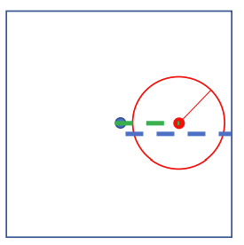
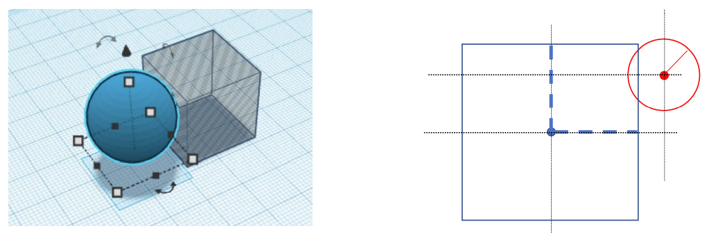
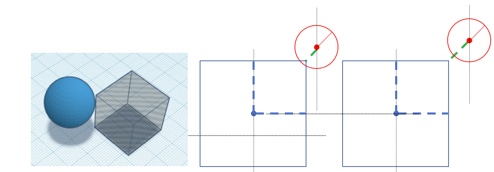
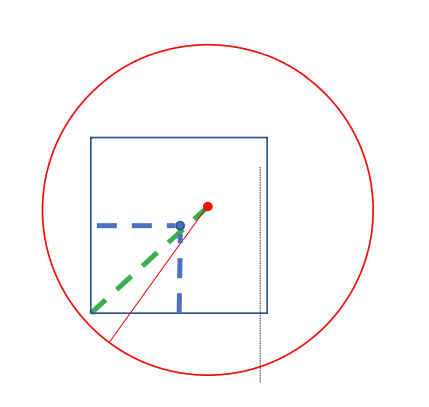

- [kd树](#kd树)
  - [Node类](#node类)
  - [构建kd树](#构建kd树)
  - [kd树的KNN搜索](#kd树的knn搜索)
  - [kd树的RadiusNN搜索](#kd树的radiusnn搜索)
- [octree](#octree)
  - [Octant类](#octant类)
  - [构建八叉树](#构建八叉树)
  - [八叉树的fast RadiusNN搜索](#八叉树的fast-radiusnn搜索)
  - [八叉树的RadiusNN搜索](#八叉树的radiusnn搜索)
  - [八叉树的KNN搜索](#八叉树的knn搜索)
  - [位置判断函数](#位置判断函数)
    - [inside()](#inside)
    - [overlaps()](#overlaps)
    - [contains()](#contains)

# kd树

## Node类

kd树结点的初始化函数如下：
```python
def __init__(self, axis, value, left, right, point_indices):
    self.axis = axis  # 选择分割的轴
    self.value = value  # 值
    self.left = left  # 左子结点
    self.right = right  # 右子结点
    self.point_indices = point_indices  # 包含的结点index
```
## 构建kd树

构建kd树时，使用 `kdtree_recursive_build()`函数递归构建。

因为kd树划分时是寻找某一维度下的中位数，然后沿中位数进行划分，所以第一步是对点云数据进行排序：
```Python
point_indices_sorted, _ = sort_key_by_vale(point_indices, db[point_indices, axis])
```

排序之后便可以轻松的找到中点，就很容易对当前轴进行划分：
```Python
middle_left_idx = math.ceil(point_indices_sorted.shape[0] / 2) - 1
middle_left_point_idx = point_indices_sorted[middle_left_idx]
middle_left_point_value = db[middle_left_point_idx, axis]

middle_right_idx = middle_left_idx + 1
middle_right_point_idx = point_indices_sorted[middle_right_idx]
middle_right_point_value = db[middle_right_point_idx, axis]
```

特别要注意，对于kd树中的非叶结点，其 `value` 值为分割线两侧点 `value` 值的平均值：

```Pyhton
root.value = (middle_left_point_value + middle_right_point_value) / 2
```

紧接着，对于分割线两侧的点分别进行划分：
```python
root.left = kdtree_recursive_build(root.left,
                                   db,
                                   point_indices_sorted[0:middle_right_idx],
                                   axis_round_robin(axis, dim=db.shape[1]),
                                   leaf_size)
root.right = kdtree_recursive_build(root.right,
                                    db,
                                    point_indices_sorted[middle_right_idx:],
                                    axis_round_robin(axis, dim=db.shape[1]),
                                    leaf_size)
```

## kd树的KNN搜索

首先需要判断该结点是否为叶结点，如果为叶结点，则不需要继续进行子结点的遍历，只需要对当前节点下的元素遍历求距离然后尝试添加到 `result_set` 中：
```python
if root.is_leaf():
    # compare the contents of a leaf
    leaf_points = db[root.point_indices, :]
    diff = np.linalg.norm(np.expand_dims(query, 0) - leaf_points, axis=1)
    for i in range(diff.shape[0]):
        result_set.add_point(diff[i], root.point_indices[i])
    return False
```

如果不是叶结点时则需要对于当前节点的子结点进行遍历搜索，以目标点位于当前结点左子结点为例，代码如下：
```python
if query[root.axis] <= root.value:
    kdtree_knn_search(root.left, db, result_set, query)
    # 在遍历一侧结束之后，如果查询点与当前点的距离之差小于result_set的最大距离
    # 则说明当前点的另一侧也有可能有符合要求的点存在。
    if math.fabs(query[root.axis] - root.value) < result_set.worstDist():
        kdtree_knn_search(root.right, db, result_set, query)
```
要注意这里当左侧结点遍历结束后，如果父结点与目标结点的距离小于当前K个结果中最远距离，说明父结点右子结点可能存在比当前 `result_set` 中距离目标结点更近的点，因此需要遍历父结点右子节点。

## kd树的RadiusNN搜索

RadiusNN搜索的代码逻辑和KNN搜索的逻辑相同，代码也大致相同，不同的是添加新结点时候的处理方式：
- KNN：对比当前结点距目标结点距离与当前 `result_set` 内存储结点的距离，然后使用更近的点替换 `result_set` 内元素；
- RadiusNN：判断当前结点距离是否小于预先设置的radius值，只要小于便添加至最终结果。


# octree

## Octant类

八叉树结点Octant类的 `__init__()` 如下：
```python
def __init__(self, children, center, extent, point_indices, is_leaf): 
    self.children = children  # 子结点
    self.center = center  # cube中心点
    self.extent = extent  # cube半边长
    self.point_indices = point_indices  # cube包含的点index
    self.is_leaf = is_leaf  # 叶结点标志位
```

## 构建八叉树

八叉树构建时首先需要判断当前cube是否有必要划分，如果当前cube内结点数较少或者cube尺寸较小时则不再进行划分：
```python
if len(point_indices) <= leaf_size or extent <= min_extent:
    root.is_leaf = True
```

对于需要划分的cube，首先需要将所有的点划分至八个区域，具体代码如下：
```python
for point_idx in point_indices:
    point_db = db[point_idx]
    # 这里使用或运算编码点云数据和center之间的关系
    # 2^3 = 8
    morton_code = 0
    if point_db[0] > center[0]:
        # 1 == 0b001
        morton_code = morton_code | 1
    if point_db[1] > center[1]:
        # 2 == 0b010
        morton_code = morton_code | 2
    if point_db[2] > center[2]:
        # 4 == 0b100
        morton_code = morton_code | 4
    # 这里存储过程类似于哈希表，存储的是点的index
    children_point_indices[morton_code].append(point_idx)
```

将所有点划分至八个子cube之后便可以递归子结点，这里需要定义八个子cube的中心点，这里以第 $i$ 个子cube为例，同样通过位运算判断当前 $i$ 值下对应的cube，然后计算第 $i$ 个子cube的中心点：
```python
factor = [-0.5, 0.5]

child_center_x = center[0] + factor[(i & 1) > 0] * extent
child_center_y = center[1] + factor[(i & 2) > 0] * extent
child_center_z = center[2] + factor[(i & 4) > 0] * extent
```

最后便可以得到子cube：
```python
root.children[i] = octree_recursive_build(root.children[i],
                                          db,
                                          child_center,
                                          child_extent,
                                          point_indices[morton_code == i],
                                          leaf_size,
                                          min_extent)
```

## 八叉树的fast RadiusNN搜索

首先判断当前cube是否被目标结点的球完全包含，如果完全包含，则不需要遍历当前cube的子cube，全部添加即可：
```python
if contains(query, result_set.worstDist(), root):
    leaf_point = db[root.point_indices]
    diff = np.linalg.norm(np.expand_dims(query, 0) - leaf_point, axis=1)
    for i in range(diff.shape[0]):
        result_set.add_point(diff[i], root.point_indices[i])
    return False
```

如果当前cube是叶结点，则对当前cube所有结点进行遍历，尝试添加到 `result_set` 中。

遍历结束之后，如果目标结点的球完全被当前cube包含，则不需要对当前cube的兄弟cube进行遍历，返回 `False`：

如果不是叶结点，则需要对当前cube的子cube进行遍历搜索，注意排除与目标结点球不相交的子cube。

## 八叉树的RadiusNN搜索

和fast RadiusNN搜索相比，RadiusNN搜索不判断当前cube是否被目标结点球包含。

在处理完当前cube为叶结点后，按照目标结点位置先迭代最有可能的子cube，在最有可能子cube没有完全包含目标结点球时继续遍历其他子cube：
```python
if octree_radius_search(root.children[morton_code], db, result_set, query):
    return True

for i, child in enumerate(root.children):
    if i == morton_code or not child:
        continue
    if not contains(query, result_set.worstDist(), child):
        continue
    if octree_radius_search(child, db, result_set, query):
        return True
```

## 八叉树的KNN搜索

KNN搜索与RadiusNN搜索逻辑相当，不同点在于添加新结点的方式，这一点的不同在kd树中已经有表述。

## 位置判断函数

### inside()

`inside()` 函数用于判断 the query ball 是否在 the octant 内部，代码如下：
```python
def inside(query: np.ndarray, radius: float, octant:Octant):
    query_offset = query - octant.center
    query_offset_abs = np.fabs(query_offset)
    possible_space = query_offset_abs + radius
    return np.all(possible_space < octant.extent)
```
示意图如下：



### overlaps()

`overlaps()` 函数用于判断 the query ball 是否和 the octant相交。

关于相交的判断比较复杂，作者分三步进行，先设cube中心和 the query ball之间的偏差为 `query_offset_abs`。

首先，如果 `query_offset_abs` 中有一个元素大于 the octant的半边长加球半径，则两者一定不相交：
```python
max_dist = radius + octant.extent
if np.any(query_offset_abs > max_dist):
    return False
```
如下图：


紧接着，如果 `query_offset_abs` 中存在两个元素小于 the octant的半边长，即该球正对 the octant 某一面，此时结合上一条件，则二者一定相交：
```python
if np.sum((query_offset_abs < octant.extent).astype(np.int)) >= 2:
    return True
```
如下图：


最后就要考虑球位于 the octant 边角位置，这时候计算球距离边的距离：
```python
x_diff = max(query_offset_abs[0] - octant.extent, 0)
y_diff = max(query_offset_abs[1] - octant.extent, 0)
z_diff = max(query_offset_abs[2] - octant.extent, 0)

return x_diff * x_diff + y_diff * y_diff + z_diff * z_diff < radius * radius
```

如下图：


### contains()

`contains()` 函数用来判断是否 the query ball 包含 the octant，这个相对容易些，示意图如下：



代码为：
```python
def contains(query: np.ndarray, radius: float, octant:Octant):

    query_offset = query - octant.center
    query_offset_abs = np.fabs(query_offset)

    query_offset_to_farthest_corner = query_offset_abs + octant.extent

    return np.linalg.norm(query_offset_to_farthest_corner) < radius
```